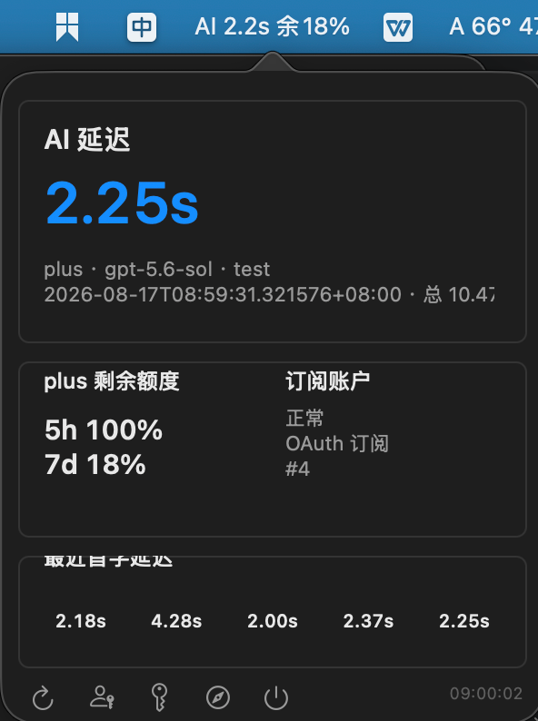
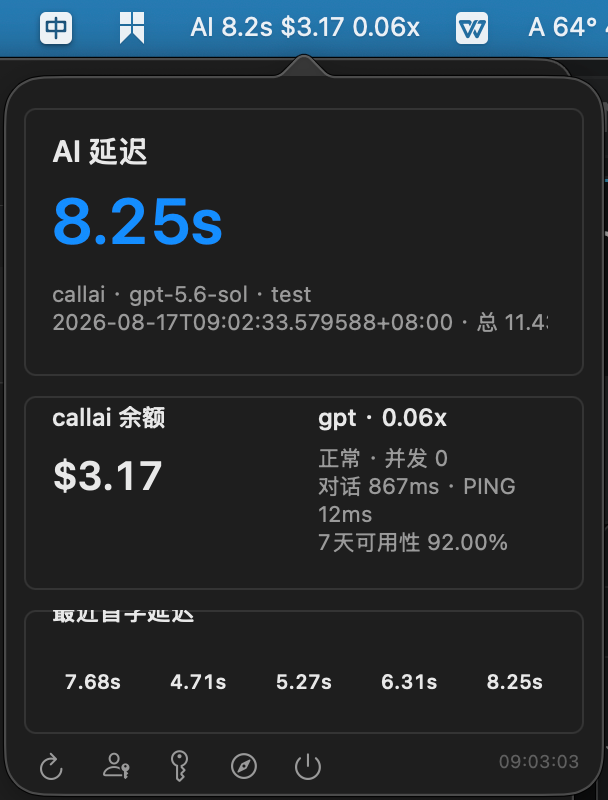
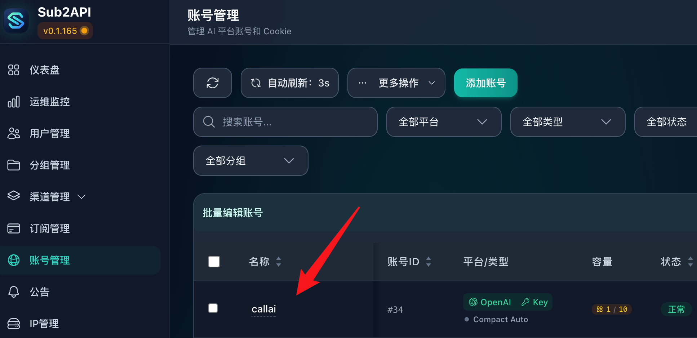
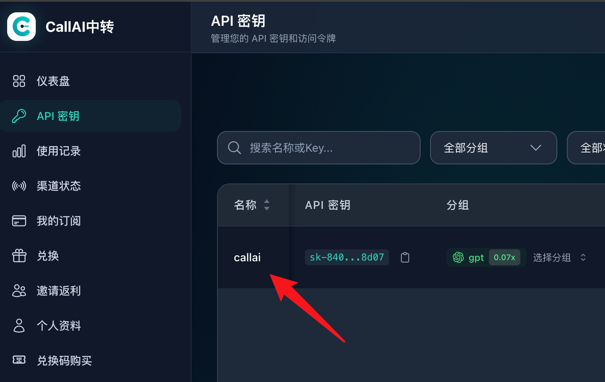

# Sub2API Menu Bar

A small native macOS menu bar monitor for a self-hosted
[Sub2API](https://github.com/Wei-Shaw/sub2api) gateway.

Configure Codex or another agent once against Sub2API, then observe which
upstream account handled the latest request without restarting the agent when
you change routing in Sub2API.

> Early release: the UI is currently Chinese and the supported upstream
> monitoring API follows the endpoints documented below.

## What it shows

- First-token latency (TTFT) and total request duration
- The actual upstream account selected by Sub2API
- API key relay versus OAuth subscription classification
- OAuth 5-hour and 7-day remaining quota
- Optional relay balance, group multiplier, current concurrency, channel
  latency, PING, and 7-day availability
- The five most recent TTFT samples

The app is read-only. It does not change Sub2API routing or account state.
Tokens captured after web login are stored in macOS Keychain, not in the JSON
configuration.

## Screenshots

The menu bar adapts to the account type selected by Sub2API. OAuth accounts
show remaining subscription quota, while API key relays show balance,
multiplier, concurrency, PING, and availability.

<table>
  <tr>
    <th>OAuth subscription</th>
    <th>API key relay</th>
  </tr>
  <tr>
    <td></td>
    <td></td>
  </tr>
</table>

## Requirements

- macOS 13 or newer
- A reachable, self-hosted Sub2API instance
- An administrator account that can read usage and upstream-account data

## Install

Download the universal macOS ZIP from the
[latest release](https://github.com/huangsw666/sub2api-menubar/releases/latest),
extract it, then open `install.command`. The app is ad-hoc signed but not yet
notarized, so macOS may require Control-clicking the command and choosing Open.
After that explicit approval, the installer removes the quarantine attribute
from only the installed app bundle so its LaunchAgent can start it.

The package supports both Apple Silicon and Intel Macs and does not require
Xcode. To build from source instead, install Apple Command Line Tools and run:

```bash
git clone https://github.com/huangsw666/sub2api-menubar.git
cd sub2api-menubar
./scripts/install.sh
```

On first install, the script creates:

```text
~/Library/Application Support/Sub2APIMenuBar/config.json
```

Edit `sub2api_base_url`, then restart the service:

```bash
launchctl kickstart -k "gui/$(id -u)/io.github.huangsw666.sub2api-menubar"
```

Click `AI --` in the menu bar and use the key button to sign in to Sub2API.
The login page must store `auth_token` (and optionally `refresh_token`) in
browser local storage, as current Sub2API releases do.

## Configuration

The minimal configuration monitors the latest matching Sub2API request:

```json
{
  "sub2api_base_url": "https://sub2api.example.com",
  "sub2api_login_path": "/login",
  "tracked_user_id": null,
  "tracked_api_key_id": null,
  "tracked_group": null,
  "usage_interval_seconds": 10,
  "channel_interval_seconds": 30,
  "balance_interval_seconds": 60,
  "http_timeout_seconds": 8
}
```

Set any tracking field to narrow the usage query. Leave it `null` to accept
the latest usage record visible to the signed-in administrator.

### Automatic API key relay discovery

No relay adapter is required for the normal case. When the latest request uses
an API key account, the app automatically:

1. Reads the account name and `credentials.base_url` from Sub2API.
2. Opens the monitoring site at the origin of that URL.
3. Finds the API key whose name exactly matches the Sub2API account name
   (case-insensitive).
4. Reads that key's group, multiplier, and concurrency.
5. Uses the group name to query channel latency, PING, and availability.

For example, a Sub2API account named `callai` must have an API key named
`callai` on the third-party relay. Matching is case-insensitive, but otherwise
exact: if no same-name key exists, the app reports the mismatch instead of
guessing another key. On first use, the app asks you to sign in to the
discovered monitoring site and stores its token in macOS Keychain.

<table>
  <tr>
    <th>1. Sub2API account name</th>
    <th>2. Third-party relay API key name</th>
  </tr>
  <tr>
    <td></td>
    <td></td>
  </tr>
</table>

The relay is expected to expose:

- `GET /api/v1/auth/me` with a `balance` field
- `GET /api/v1/keys` with key group, multiplier, and concurrency fields
- `GET /api/v1/channel-monitors` with status, latency, PING, and availability

Responses may be arrays or common paginated objects using `items`, `records`,
`list`, or `monitors`.

### Optional relay overrides

Most users do not need this. Add an entry to `upstreams` only when the relay's
monitoring origin, login path, API key name, or channel group cannot be derived
with the rules above:

```json
{
  "name": "Example Relay",
  "account_names": ["example-relay"],
  "base_url": "https://relay.example.com",
  "login_path": "/login",
  "key_name": "my-key-name",
  "channel_group": "gpt"
}
```

`account_names` are the names reported by Sub2API and matching is
case-insensitive.

## Service management

```bash
./scripts/status.sh
./scripts/uninstall.sh
```

Uninstalling removes only the LaunchAgent. The compiled app, configuration,
and Keychain tokens are retained so a reinstall does not destroy local data.

The release installer migrates configuration from the original
`local.ai-latency-monitor` prototype. The app then imports matching legacy
Keychain tokens through the native Security API on first use; macOS may ask
you to confirm access once.

## Build directly

```bash
xcrun swiftc -swift-version 5 \
  -framework AppKit -framework WebKit -framework Security \
  Sources/Sub2APIMenuBar.swift -o Sub2APIMenuBar
```

Build the universal release ZIP and SHA-256 checksum with:

```bash
./scripts/build-release.sh
```

## Project status

This is a personal tool being opened early to validate broader use cases.
Please use the issue templates for bugs, compatible relay APIs, and feature
requests. See [ROADMAP.md](ROADMAP.md) for the next planned steps.

## License

[MIT](LICENSE)
